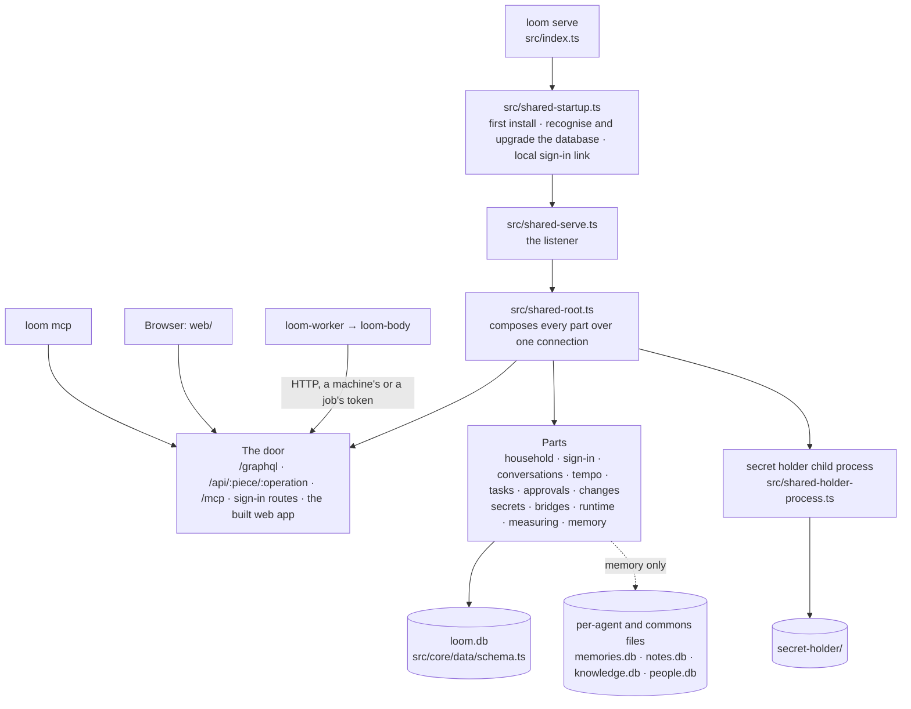

# loom at a glance

What the program is today: what starts it, the parts it is built from, and where every
table lives. For the words used here see `CONTEXT.md`; for the household database's
design see `docs/data-schema.md`.

`src/architecture.contract.test.ts` keeps this page honest in four ways. Every file or
directory named here in backticks must exist. Every table in `src/core/data/schema.ts`
must be named here. Every table created anywhere else in `src/` must be named here too.
And a table named here must still be created somewhere, so a removed store cannot linger
on the page. The test cannot tell whether a sentence is true, so when you move a part,
reread its paragraph.

## What starts

`package.json` installs eight executables. Only `loom serve` opens a household's data.

| Executable | Source | What it does |
|---|---|---|
| `loom serve` | `src/index.ts`, then `src/shared-startup.ts` | Runs the household's program: one process, one HTTP listener, one household database. |
| `loom signin` | `src/index.ts`, then `src/core/signin/operator.ts` | Asks the running program for a one-time sign-in link, over a socket only the data folder's owner can reach. It opens no store. |
| `loom mcp` | `src/index.ts`, then `src/shared-mcp-stdio.ts` | A stdio MCP session that forwards to a running `loom serve` over HTTP. It opens no store. |
| `loom-worker` | `src/worker.ts`, then `src/runtime/worker-program.ts` | Runs on a machine that does work. Asks the program for jobs, starts a body for each, reports back. |
| `loom-body` | `src/body.ts`, then `src/runtime/body-program.ts` | One run of one agent, started only by a worker. Drives a harness (`src/runtime/body-harnesses.ts`). |
| `loom-household`, `loom-taskstore`, `loom-token`, `loom-account`, `loom-sessions` | `src/household-client.ts`, `src/taskstore-client.ts`, `src/token-client.ts`, `src/account-client.ts`, `src/sessions-client.ts`, all over `src/cli` | Command-line clients of the running program's HTTP door. They open no store. |

`loom` accepts `serve`, `signin`, `mcp` (also under its earlier spelling, `--next`),
`--version` and `--help`, and nothing else. The
older program (its own stdio server, a subcommand per verb, server-rendered pages) is
gone, and so are the copies of the household, its tokens, browser sessions and secrets
that it and an earlier composition kept beside the ones that run.

## How `loom serve` is put together

```mermaid
flowchart TB
  CLI["loom serve<br/>src/index.ts"] --> START["src/shared-startup.ts<br/>first install · recognise and upgrade the database · local sign-in link"]
  START --> SERVE["src/shared-serve.ts<br/>the listener"]
  SERVE --> ROOT["src/shared-root.ts<br/>composes every part over one connection"]
  ROOT --> DOOR["The door<br/>/graphql · /api/:piece/:operation · /mcp · sign-in routes · the built web app"]
  ROOT --> PARTS["Parts<br/>household · sign-in · conversations · tempo · tasks · approvals · changes<br/>secrets · bridges · runtime · measuring · memory"]
  PARTS --> DB[("loom.db<br/>src/core/data/schema.ts")]
  PARTS -. memory only .-> FILES[("per-agent and commons files<br/>memories.db · notes.db · knowledge.db · people.db")]
  ROOT --> HOLDER["secret holder child process<br/>src/shared-holder-process.ts"]
  HOLDER --> HDB[("secret-holder/")]
  WORKER["loom-worker → loom-body"] -- "HTTP, a machine's or a job's token" --> DOOR
  BROWSER["Browser: web/"] --> DOOR
  MCP["loom mcp"] --> DOOR
```

**Startup** (`src/shared-startup.ts`). On an empty home, `src/shared-initialize.ts` builds
the first household beside it and publishes it in one rename. Startup then reads
`program.json` (where the database, the Comms key and the memory files are), recognises
the database read-only, takes ownership of the home, upgrades the database if it is at an
earlier schema number, starts the secret holder, and serves. It prints one local sign-in
link.

**The door** (`src/shared-root.ts`). Every outside caller, whether browser, command-line
client, MCP session, worker or body, comes through one HTTP listener:

- `/graphql` (HTTP and WebSocket) for reads and live subscriptions: `src/next-data.ts` over
  `src/core/data` (`http.ts`, `socket.ts`, `queries.ts`, `subscriptions.ts`). Each table's
  visibility rule is a SQL predicate in `src/core/data/visibility.ts` and its neighbours.
- `/api/:piece/:operation` for every write: a registered operation, checked and given a
  retry receipt by `src/core/operations`, committed through `src/core/data/writes.ts`.
- `/mcp`: `src/shared-mcp.ts` and `src/shared-mcp-named.ts` map MCP tool names onto those
  same operations and queries. It is not a door of its own; a call through it arrives as
  an HTTP call.
- Sign-in routes (`src/core/signin`) and the built web app (`src/shared-web.ts`, from `web`).

Who the caller is comes from `src/shared-credentials.ts` and
`src/core/data/authentication.ts`; what they may do from `src/policy.ts` over the current
facts in `src/shared-sharing.ts`. Parts call each other directly in process and carry no
policy of their own; the `src/shared-*.ts` files are where each part meets the door.

A few rules that every part needs are stated once: the slug pattern and its three lengths
in `src/slug.ts`, how long Comms keeps words in `src/core/data/comms-days.ts`, what an
unset household has (its time zone among them) in `src/core/data/household-settings.ts`,
how a client outside the program reads its address and token in `src/cli/connection.ts`,
and the size of one request in `src/core/data/door-limit.ts`, which the door's three ways
in and `loom-taskstore` share. `src/single-home.contract.test.ts` and
`src/stored-data.contract.test.ts` fail when one of these is copied again in the files
they name.

Choices that were made on purpose and look like oversights are listed, with why, in
`docs/accepted-tradeoffs.md`.

## The parts

| Part | Where | What it owns |
|---|---|---|
| Household | `src/apps/household.ts`, `src/shared-household-proposals.ts`, `src/shared-projects.ts` | Members, agents, projects, settings; changes an agent proposes for an owner to allow. |
| Sign-in | `src/core/signin`, `src/shared-credentials.ts` | Tokens, browser sessions, one-time links, passkeys, notification devices. |
| Conversations | `src/core/conversations`, `src/shared-conversations.ts` | Conversations, turns, digests, the inbox, threads and their encrypted messages (`src/pieces/comms/crypto.ts`). |
| Tempo | `src/core/tempo`, `src/shared-tempo.ts` | Triggers, their log, pauses, inbox volume and quiet times. |
| Tasks and approvals | `src/apps/tasks.ts`, `src/apps/approvals.ts` and their neighbours in `src/apps` | Tasks, links, comments; permission requests, standing rules, the permanent record. |
| Changes | `src/apps/changes.ts`, `src/pieces/changes` | Pull requests read from GitHub and what was answered about them. |
| Secrets | `src/pieces/secrets`, `src/shared-secret-commands.ts` | Names, grants, requests and uses in the household database; the values only in the holder process. |
| Bridges | `src/pieces/bridges`, `src/shared-bridge-commands.ts` | Discord and Slack connections: what came in, what was sent. |
| Runtime | `src/runtime`, `src/shared-runtime.ts` | Machines, jobs and their placement, model accounts; the worker and body programs. |
| Measuring | `src/core/measuring` | Daily timing roll-ups, off by default. |
| Memory | `src/pieces/mind`, `src/backends`, `src/shared-memory.ts`, `src/shared-notes.ts`, `src/notes.ts` | Memories, person and project cards, notes and knowledge. The only part whose data is outside the household database. |

Memory's files are opened by `src/shared-memory.ts` from the paths `program.json` declares.
`src/backends/sqlite-vec.ts` is the memory store (vector search; embeddings from
`src/backends/fastembed.ts`), `src/backends/sqlite-knowledge.ts` the knowledge store,
`src/backends/people.ts` and `src/backends/projects.ts` the cards over the shared rules in
`src/backends/cards.ts`. A knowledge page is written only through
`src/backends/knowledge-writes.ts`, by the store and by the door's page actions alike, and
a receipt for a write to one of these files only through `src/pieces/mind/receipt-schema.ts`.
`src/backends/salience.ts` and `src/backends/episodes.ts` make the
two slices a body wakes with: Top of Mind, and the tape. The tape's conversation digests
come from the household database, handed in by `src/transport/memory-queries.ts`.

## Where every table lives

A home (`~/.config/loom` unless `--home` or `LOOM_HOME` says otherwise) holds these stores.

### `loom.db`: the household database

Defined once, in `src/core/data/schema.ts`. `assets/data/schema.sql` is generated from it
and creates a fresh database; `upgrades` in `src/core/data/database.ts` brings an older
one to the same shape, and `src/core/data/shipped-shapes` pins the installation SQL of
every schema number so `src/core/data/upgrade.test.ts` can prove it. Startup refuses a
database it does not recognise without writing to it.

| Area | Tables |
|---|---|
| Household | `members`, `agents`, `member_agents`, `projects`, `project_members`, `project_agents`, `project_repositories`, `agent_accounts`, `agent_sprites`, `household`, `backup_recipients`, `member_preferences` |
| Sign-in | `tokens`, `program_tokens`, `program_record_grants`, `program_operation_grants`, `sessions`, `signin_links`, `passkeys`, `notification_devices`, `notification_queue` |
| Tasks | `tasks`, `task_links`, `task_comments` |
| Conversations | `conversations`, `conversation_people`, `turns`, `digests`, `digest_items`, `agent_status`, `conversation_days`, `findings` |
| Inbox and threads | `inbox`, `inbox_refs`, `inbox_reads`, `action_results`, `threads`, `messages`, `thread_refs`, `deleted_threads` |
| Approvals | `approvals`, `approval_rules`, `approval_notices`, `approval_record` |
| Tempo | `triggers`, `trigger_log`, `trigger_edits`, `agent_pauses`, `tempo_settings` |
| Changes | `changes`, `change_checks`, `change_people`, `change_tasks`, `change_sync` |
| Runtime | `boxes`, `box_agents`, `box_facts`, `jobs`, `job_needs`, `agent_run_settings`, `agent_boxes`, `agent_house_secrets`, `agent_house_ports`, `agent_people`, `agent_denied_tools`, `model_accounts`, `model_account_windows`, `model_account_boxes`, `agent_models`, `account_signins` |
| Bridges | `bridge_connections`, `bridge_channel_filters`, `bridge_channels`, `bridge_people`, `bridge_incoming`, `bridge_sends`, `bridge_send_parts`, `bridge_files`, `bridge_raw_events`, `bridge_resume` |
| Secrets | `secrets`, `secret_grants`, `secret_requests`, `secret_rules`, `secret_rule_agents`, `secret_uses`, `secret_changes`, `secret_write_journal` |
| Measuring | `timing_days`, `measuring_settings` |
| Bookkeeping | `migrations` (the schema number), `operation_results` (retry receipts) |

### `agents/<agent>/memories.db`: one per agent

| Tables | Made by |
|---|---|
| `memories`, `vec_memories` | `src/backends/sqlite-vec.ts` |
| `proposals`, `memory_revisions`, `memory_supersessions`, `memory_deletions` | `src/backends/migrations.ts` |
| `people`, `person_revisions`, `person_merges`: the agent's relationship cards | `src/backends/migrations.ts`, used by `src/backends/people.ts` |
| `projects`, `project_revisions`, `project_names`: the agent's project cards | `src/backends/migrations.ts`, used by `src/backends/projects.ts` |
| `conversation_turns`, `conversation_digests`, and this file's own `conversations` and `conversation_days` | `src/backends/conversations.ts`. Left from before conversations moved to `loom.db`. Still created, never read or written. |
| `mind_operation_receipts`, `mind_source_migrations` | `src/pieces/mind/receipt-schema.ts`: retry receipts for writes to this file |
| `memory_command_preparations`, `memory_command_receipts`, `memory_command_schema`, `memory_card_references`, `memory_card_schema` | `src/pieces/mind/semantic-schema-sql.ts` |

Four names here (`projects`, `conversations`, `conversation_days`, and `people` in the
commons) also exist in other stores with other columns. A table belongs to the file it is
in; `src/core/data/schema.ts` describes `loom.db` and nothing else.

### `agents/<agent>/notes.db`: one per agent

`notes`, `note_revisions`, `note_files`, from `src/notes.ts`; the attached files sit beside
it, stored once by content.

### `commons/knowledge.db` and `commons/people.db`: shared by every agent

| Store | Tables | Made by |
|---|---|---|
| `knowledge.db` | `pages`, `citations`, `supersessions`, `page_revisions`, `verifications`, `knowledge_access`, and its own `mind_operation_receipts` | `src/backends/sqlite-knowledge.ts` |
| `people.db` | `people`, `person_revisions`, `person_merges` (the directory half of each person), and its own `mind_operation_receipts` | `src/backends/people.ts`, by the same steps in `src/backends/migrations.ts` |

A new person is two cards, the directory's and the adding agent's, written by
`src/pieces/mind/people-actions.ts`. A refusal or a failure on either side saves neither.
The two files cannot commit as one, so a crash between their commits can leave the agent's
card alone; adding the same person again then finishes the pair
(`src/backends/people-creation.ts`).

### `secret-holder/`: the holder process's own store

`holder_config`, `holder_generation`, `holder_key_history`, `holder_values`,
`holder_receipts`, `holder_aborted_writes`, from `src/pieces/secrets/holder-store.ts`.
Secret values are here, encrypted, and nowhere else.

### How each store knows its version

`loom.db` holds its schema number in `migrations` and is recognised in full before it is
touched. The others keep a number in the file header (`PRAGMA user_version`) and no table:

- `memories.db` and `people.db`: how many steps of `src/backends/migrations.ts` the newest
  program to prepare the file knows. Each step still decides from the file's shape whether
  it is pending, and runs whole or not at all; the number only lets an older program refuse
  a file a newer one has changed.
- `knowledge.db`: 1. A newer number, or a file with tables but no `pages`, is refused.
- `notes.db`: 1. A newer number is refused.

Only `loom.db` and `knowledge.db` are checked for being the right kind of file at all; see
`docs/accepted-tradeoffs.md`.

## Code no program starts

One thing is compiled but reached by no executable, for a stated reason.

- **The example household.** `src/example-home.ts`, `src/example-home-adapters.ts`,
  `src/example-runtime.ts` and `src/rebuild` build and check a fictitious home. They are
  run by `scripts/example-home.mjs` and the acceptance walkthrough
  (`docs/example-household.md`). The adapters file is loaded by path, from a file the
  example writes into its home, so no import names it.

An agent's old conversation tables (above) are the one thing kept for the move of an older
home's data. `docs/migration-plan.md` and `docs/migration-registry.md` describe that move;
the commands they name were removed with the older program and are in the repository's
history.

## Elsewhere

- `web`: the browser app, built by Vite into `dist/web` and served by the program.
- `scripts`: build, CI and acceptance scripts; `scripts/generate-data-schema.ts` writes `assets/data/schema.sql`. They import the build (`dist`), not `src`.
- Test fixtures are named `*.fixture.ts` beside the tests that use them, or live in `test/fixtures`; neither is compiled into `dist`.
- `docs/specs`: the designs each part was built from. Several describe the older program; where one disagrees with this page, the code decides.
